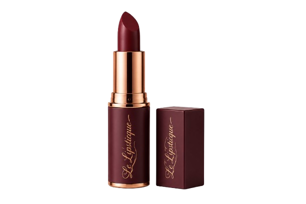
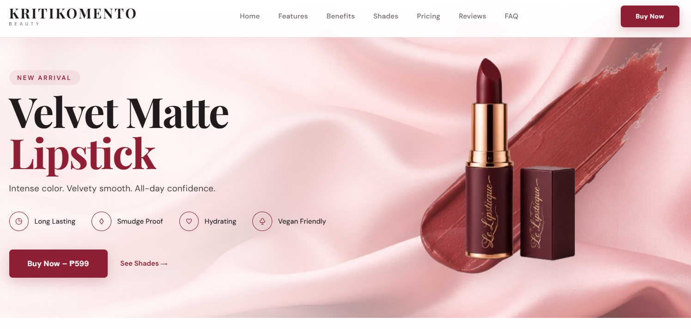
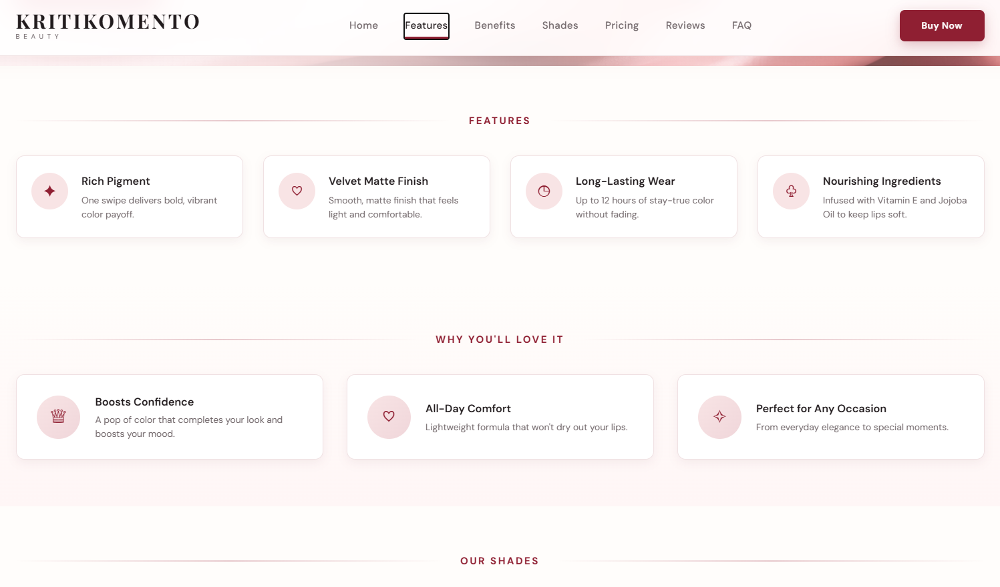
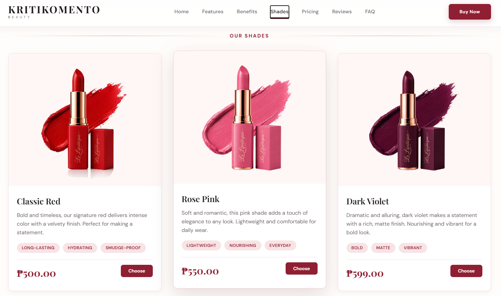

# KRITIKOMENTO | Velvet Matte Lipstick Landing Page

A premium, fully responsive business landing page for **KRITIKOMENTO** — a luxury velvet matte lipstick brand. Designed with elegance, smooth animations, responsive layouts, and a seamless user experience across desktop, tablet, and mobile devices.

---

## 📸 Project Preview

### Desktop View

### Features Section

### Shades Showcase

---

## ✨ Features

### 🎨 Visual Design
- **Elegant Brand Aesthetic** — Wine, cream, pink, and rose-inspired color palette.
- **Luxury Typography** — Combination of `Playfair Display` and `DM Sans`.
- **Satin Background** — Premium textured background for the visual sections.
- **Smooth Animations** — Scroll-triggered fade-in effects and animated elements.
- **Floating Product Image** — Gentle floating animation for the hero lipstick.
- **Interactive FAQ** — Accordion-style FAQ with `+` and `×` toggle icons.
- **Glass-Morphism Header** — Semi-transparent sticky navigation with scroll effects.

### 📱 Responsive Design
The landing page is designed to adapt to different screen sizes:
- **Desktop** — Full-width layouts with multi-column grids.
- **Tablet** — Adaptive two-column layouts.
- **Mobile** — Single-column layouts with touch-friendly navigation.
- **Small Mobile** — Additional typography and spacing adjustments for screens below `420px`.

---

## 🧩 Core Sections

| Section | Description |  
|---|---|  
| **Hero** | Brand headline, product description, feature badges, and CTA buttons |  
| **Features** | Four key product benefits: Rich Pigment, Velvet Matte, Long-Lasting, and Nourishing |  
| **Benefits** | Three emotional selling points: Confidence, Comfort, and Versatility |  
| **Shades** | Three lipstick variants: Classic Red, Rose Pink, and Dark Violet |  
| **Pricing** | Tiered lipstick packages for 1, 2, or 3 products |  
| **Testimonials** | Four customer reviews with avatars, ratings, and verification badges |  
| **FAQ** | Common questions about sensitive lips, animal testing, longevity, and shade selection |  
| **CTA** | Final "Buy Now" call-to-action section |  
| **Footer** | Trust badges including Free Shipping, Secure Payment, 30-Day Returns, and Cruelty Free |  
| **Copyright** | Brand and designer attribution |  

---

## ⚡ Interactive Functions

* **Sticky Header:** The navigation header remains visible while scrolling and applies a shadow effect to improve readability.
* **Mobile Hamburger Menu:** On smaller screens, the desktop navigation is replaced with a hamburger menu that can be opened and closed.
* **Smooth Scrolling:** Navigation links smoothly scroll to their corresponding sections while accounting for the fixed header.
* **FAQ Accordion:** FAQ items expand and collapse interactively, toggling between `+` and `×` icons.

---

## 🎨 Design System

### Color Palette

| Color | Hex | Usage |
|---|---|---|
| Wine | `#8f1f32` | Primary brand color, buttons, headings |
| Wine Dark | `#701525` | Hover states and dark backgrounds |
| Wine Light | `#a73549` | Accent highlights |
| Wine Soft | `#f0d6da` | Soft gradients and backgrounds |
| Pink | `#f8e4e5` | Accent elements, tags, and backgrounds |
| Pink Light | `#fff6f6` | Section backgrounds |
| Cream | `#fffdfb` | Main page background |
| White | `#ffffff` | Cards and content backgrounds |
| Text | `#211b1d` | Main body text |
| Muted | `#706669` | Secondary text |
| Border | `#e7c8cc` | Borders and dividers |

---

### Typography

#### Headings
`Playfair Display` — Used for brand headings, section titles, product names, and luxury visual presentation.

#### Body
`DM Sans` — Used for paragraphs, navigation, buttons, product information, and supporting content.

---

## 🎞️ Animation System

Subtle animations improve the visual experience without overwhelming the user:

| Animation | Timing |
|---|---|
| **Scroll Reveal** | `0.7s ease` |
| **Hover** | `0.35s cubic-bezier` |
| **Floating Product** | `6s loop` |
| **FAQ Slide** | `0.3s ease` |

---

## 📱 Responsive Breakpoints

| Breakpoint | Target | Main Changes |
|---|---|---|
| `> 1024px` | Desktop | Full multi-column layouts |
| `900px – 1024px` | Small Tablet | Adjusted spacing and sizing |
| `768px – 900px` | Tablet | Two-column features and testimonials |
| `420px – 768px` | Mobile | Single-column layout and hamburger menu |
| `< 420px` | Small Mobile | Optimized typography and spacing |

---

## 🎯 Customization Guide

### Mobile Improvements
Recommended layout implementations for smaller viewports:
- Swipeable testimonial cards
- Horizontally scrollable product shades
- Sticky mobile "Buy Now" button
- Bottom navigation for important actions
- Larger touch targets and mobile-friendly controls

---

## 🌐 Browser Support

| Browser | Support |
|---|---|
| **Google Chrome** | 88+ |
| **Mozilla Firefox** | 85+ |
| **Safari** | 14+ |
| **Microsoft Edge** | 88+ |
| **Opera** | 74+ |
| **Internet Explorer** | Unsupported |

---

## 🔐 Security Considerations

The current project is a frontend-only landing page. When converting this into a production e-commerce store, ensure:
- Passwords, payment credentials, and private API keys are never stored in client-side code.
- Server-side validation and secure payment gateways (e.g., Stripe, PayPal, GCash, Maya) are utilized.
- Communications are encrypted via HTTPS with properly configured authentication cookies and rate limiting.

---

## 🚀 Deployment & Structure

### GitHub Pages Setup
1. Push repository code to GitHub.
2. Go to **Settings** > **Pages**.
3. Select your deployment source branch and click **Save**.

### Directory Structure
repository/   
│  
├── index.html  
├── style.css  
├── README.md  
│  
└── assets/  
    └── images/  
        ├── hero-lipstick.png  
        ├── satin-pink-background.png  
        ├── lipstick-red.png  
        ├── lipstick-pink.png  
        └── lipstick-violet.png  

## 🤝 Contributing

1. Fork the repository.
2. Create a feature branch (`git checkout -b feature/AmazingFeature`).
3. Commit changes (`git commit -m "Add improved lipstick product section"`).
4. Push to branch (`git push origin feature/AmazingFeature`).
5. Open a Pull Request.

---

## 📄 License

This project is licensed under the MIT License — see below for details:

Copyright (c) 2024 KRITIKOMENTO

Permission is hereby granted, free of charge, to any person obtaining a copy
of this software and associated documentation files (the "Software"), to deal
in the Software without restriction, including without limitation the rights
to use, copy, modify, merge, publish, distribute, sublicense, and/or sell
copies of the Software, and to permit persons to whom the Software is
furnished to do so, subject to the following conditions:

The above copyright notice and this permission notice shall be included in all
copies or substantial portions of the Software.

## 👤 Creator

**KRITIKOMENTO** — Contemporary artist, illustrator, and web designer portfolio project.

- **Designed By:** Your Name
- **Portfolio:** [your-portfolio.example](https://your-portfolio.example)
- **Email:** your-email@example.com
- **LinkedIn:** [linkedin.com/in/yourusername](https://linkedin.com/in/yourusername)
- **GitHub:** [github.com/yourusername](https://github.com/yourusername)

---

## 🙏 Acknowledgments

- **Google Fonts:** Playfair Display & DM Sans
- **Font Awesome:** Interface Icons
- **Web APIs:** Intersection Observer API for scroll-triggered animations

---

## 📌 Version History & Roadmap

- **v1.0.0 (Current):** Initial landing page, responsive layouts, basic animations, FAQ accordion, static assets.
- **v1.1.0 (Planned):** Image optimization, enhanced mobile controls, accessibility & SEO metadata.
- **v2.0.0 (Future):** Full e-commerce stack integration (REST API, Database, Payment Gateways, Order Management).

Frontend (HTML/CSS/JS) ──► REST API ──► Database & Payment Gateway

## ✅ Project Checklist

- [x] Semantic HTML document created
- [x] Responsive CSS stylesheets integrated
- [x] Interactive JavaScript functionality added
- [x] Documentation & media assets verified
- [ ] Connect production payment infrastructure
- [ ] Add real product inventory data & backend endpoints

---

### KRITIKOMENTO
**Velvet Matte Lipstick Landing Page**

Built with ❤️ using HTML, CSS & JavaScript.

If you found this project useful, consider giving the repository a ⭐!

